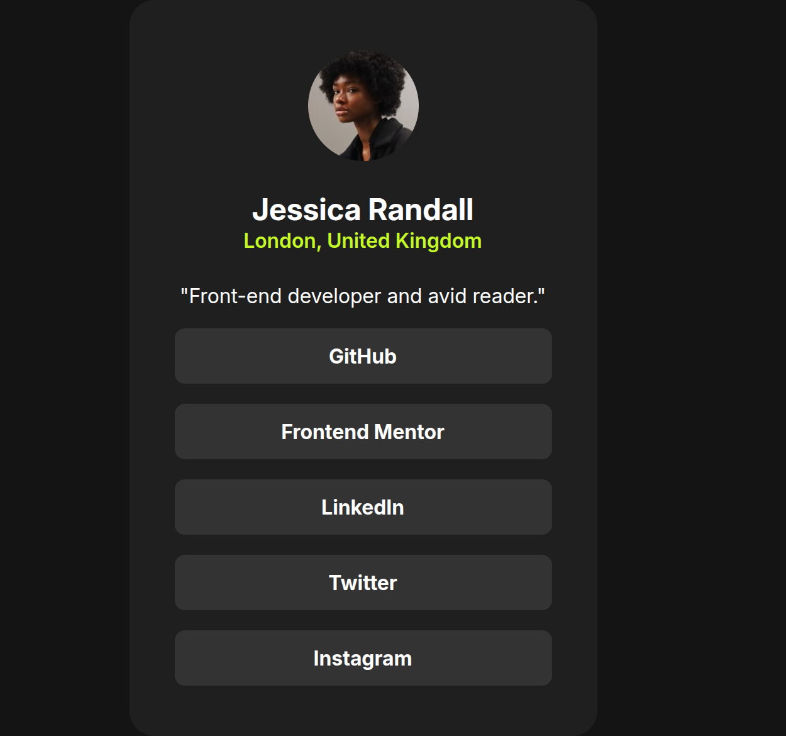

# Frontend Mentor - Social links profile solution

This is a solution to the [Social links profile challenge on Frontend Mentor](https://www.frontendmentor.io/challenges/social-links-profile-UG32l9m6dQ). Frontend Mentor challenges help you improve your coding skills by building realistic projects.

## Table of contents

- [Overview](#overview)
  - [The challenge](#the-challenge)
  - [Screenshot](#screenshot)
  - [Links](#links)
- [My process](#my-process)
  - [Built with](#built-with)
  - [What I learned](#what-i-learned)
- [Author](#author)

## Overview

### The challenge

Users should be able to:

- See hover and focus states for all interactive elements on the page

### Screenshot



### Links

- Solution URL: [https://github.com/mnav08/social-links-profile.git]
- Live Site URL: []

## My process

### Built with

- Semantic HTML5 markup
- CSS custom properties
- Flexbox
- CSS Grid

### What I learned

I learned how to work with a design without the figma file and train my eye to replicate why I see into code without so much guidance.
Also learned how to make fontsizes responsive depending on the viewport width.

```css
font-size: clamp(1rem, 2vw + 1rem, 1.5rem);
```

## Author

- Website - [https://github.com/mnav08]
- Frontend Mentor - [https://www.frontendmentor.io/profile/mnav08]
